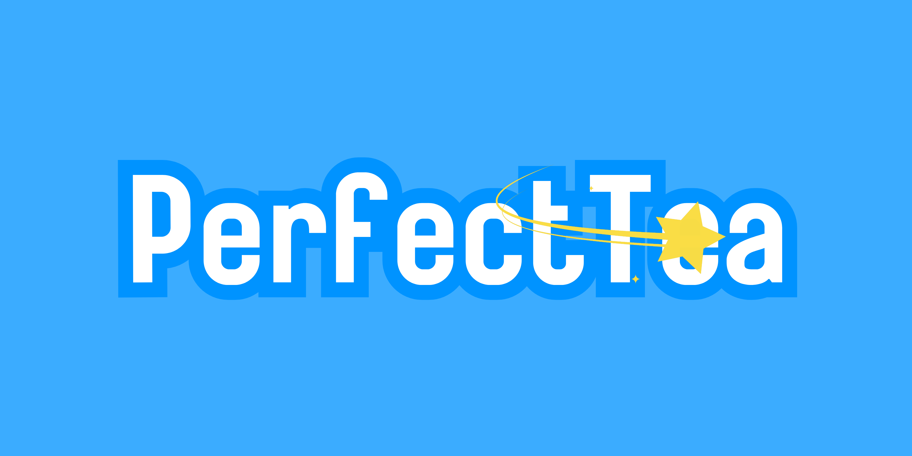

<div align="center">

<h1 align=center>🐶 LuaBot 🐶</h1>

<p align="center">
  <a href="https://top.gg/bot/1417634196477972533">
  
</a>
  
  <a href="https://github.com/LorittaBot/Loritta/watchers"></a>
<a href="https://github.com/LorittaBot/Loritta/blob/master/LICENSE"></a>

<a href="https://github.com/TheLuaBot/LuaBot/stargazers"></a>
</p>

</div>

Au Au! Eu sou a **LuaBot!** Uma simples bot canina do Discord para alegrar seu servidor! Sou uma bot Brasileira para o Discord, com comandos legais e divertidos! A Lua é baseada na personalidade de uma cachorra bem travessa, além de vários outros traços dela!

## 🤔 Como adiciono ela ao meu servidor?
Se você quer adicionar a Lua para seu servidor, você pode adicionar ela [clicando aqui](https://theluabot.squareweb.app/add).

Enquanto ainda é possível fazer "self-hosting" (Hospedar você mesmo) dela, eu não irei dar suporte para quem quiser fazer isto para evitar pessoas criando "clones" e levando todo o crédito por terem criado o bot, eu dou suporte se você quer fazer "self hosting" para ajudar e contribuir para a Lua.

## 🙋 Como ajudar?
Existem vários repositórios em nosso Github, e eles são de várias partes da Lua, para isso, deixarei aqui os links dos repositórios para quem quiser contribuir para a Lua!

  - [Lua](https://github.com/TheLuaBot/LuaBot): Código fonte da Lua( o "backend"), que inclui todas as funcionalidades do bot em si(como comandos e tasks).
  - [LuaLocales](https://github.com/TheLuaBot/LuaLocales): Arquivos de tradução da Lua.
  - [LuaVanGogh](https://github.com/TheLuaBot/LuaVanGogh): Sistema de Manipulação de imagens da Lua.
  - [Lunatic](https://github.com/TheLuaBot/Lunatic)

### 💵 Como doar?
Você pode até não saber programar, mas você pode ajudar a Lua doando! https://theluabot.squareweb.app/donate

## 🙌 Como Usar?

### 👨‍💻 Como Compilar?
Você também utilizar a Lua em algum lugar, caso você não queira usar a versão pública dela, mas...

- Nós deixamos o código fonte disponível no GitHub para que outras pessoas possam se inspirar e aprender com nossos projetos, o objetivo de deixá-la Open Source, é para não perder o código fonte dela, caso algo aconteça na Hospedagem.

- Eu não irei dar suporte caso você queria fazer self hosting apenas para você querer fazer fama com ela falando que você criou um bot, **mesmo que na verdade você apenas pegou o código-fonte dela e hospedou, lembre-se, a licença do projeto é [AGPL v3](), você é obrigado a deixar todas as suas alterações no projeto públicas!**

- Lembrando que ela precisa de algumas API Keys para  funcionalidades dela, caso você não coloque elas, talvez ela poderá ter funcionalidade reduzida ou talvez não irá funcionar corretamente!

- Você não pode utilizar o nome "LuaBot" ou a personagem LuaBot na sua versão self hosted.

Mas se você quer mesmo hospedar ela, siga esses passos:
 1. Tenha o Python e a lib do discord.py instalada na sua máquina.
 2. Tenha o Python 3(Ou Superior) na sua máquina.
 3. Tenha o MongoDB Instalado na sua Máquina(instale a lib pymongo)

## 🌐 Features
### 🎨 Sistema de Manipulação de imagens - Lua Van Gogh | Como rodar
1. Acesse o repositório
2. Clone o repositório usando git clone
3. Rode a aplicação:
```bash
py -3 main.py
```


## 🌟 Agradecimentos especiais para...


A Square Cloud tem todos os direitos reservados sobre a logo da marca.

A [Square Cloud](https://squarecloud.app) é a hospedagem que mantém a LuaBot online, e a square é totalmente segura! Eu recomendo!

***
### 🌟 PerfectTea



**A PerfectTea tem todos os direitos reservados sobre a logo da marca.**

**PerfectTea, empresa mantedora da LuaBot, no qual o objetivo é "Construir Sonhos"!**

## 📄 Licença
O Código fonte da Lua está licenciado sob a [GNU Affero General Public License v3](LICENSE)

A Lua é © Aquele Astro Lá & PerfectTea — Todos os direitos reservados.

Ao usar a Lua, você concorda com os [Termos de Uso dela.](https://theluabot.squareweb.app/guidelines).
